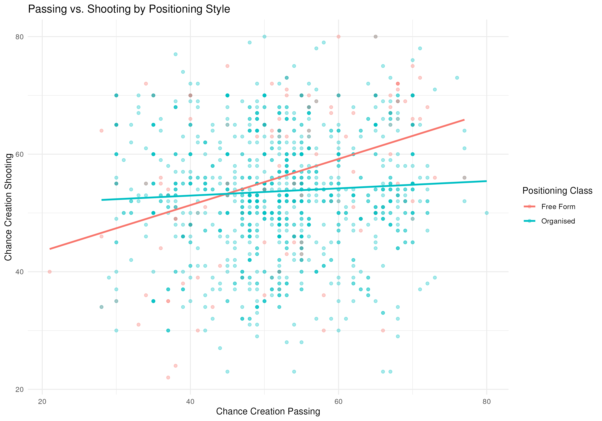

# European Soccer Tactical Analytics & Chance-Creation Modeling

**R | ggplot2 | Multiple Linear Regression | Interaction Modeling | Model Diagnostics | Sensitivity Analysis**

## Project Overview

This project analyzes how tactical characteristics of European club soccer teams are associated with chance-creation shooting.

Using **1,458 team observations and 11 tactical predictors**, I developed a multiple linear regression framework incorporating build-up play, passing, crossing, positioning, and defensive characteristics. The analysis focuses particularly on whether the relationship between passing and shooting differs across tactical positioning styles.

## Research Question

**Which tactical characteristics are associated with chance-creation shooting, and does the passing–shooting relationship differ between Free Form and Organised positioning styles?**

## Dataset

The modeling dataset contains:

- **1,458 team observations**
- **11 tactical predictors**
- Response variable: `chanceCreationShooting`
- Continuous and categorical tactical attributes covering build-up play, chance creation, positioning, and defensive strategy
- No missing values among variables included in the final model

## Analytical Approach

The analysis was conducted in **R** and included:

1. Exploratory visualization of passing, shooting, and positioning style
2. Multiple linear regression with continuous and categorical predictors
3. Interaction modeling between `chanceCreationPassing` and `chanceCreationPositioningClass`
4. Statistical inference for positioning-specific passing slopes
5. Residual, Q-Q, scale-location, and leverage diagnostics
6. Cook's Distance analysis for influential observations
7. Sensitivity analysis after excluding potentially influential observations

## Key Finding: Positioning Style Moderates the Passing-Shooting Relationship

The model identified a statistically significant interaction between **chance-creation passing and positioning style (p < 0.001)**.

- **Free Form teams:** estimated passing slope = **0.351**
- **Organised teams:** estimated passing slope = **0.033**
- The Organised-team slope was not statistically significant (**p = 0.255**)

This suggests that higher passing scores are much more strongly associated with higher chance-creation shooting scores among teams using **Free Form positioning**, while the relationship is comparatively weak among teams using **Organised positioning**.



## Model Diagnostics & Robustness

Model assumptions and influential observations were evaluated using:

- Residuals vs. Fitted
- Normal Q-Q
- Scale-Location
- Residuals vs. Leverage
- Cook's Distance

Using a Cook's Distance threshold of `4/n`, **92 observations** were flagged as potentially influential.

A sensitivity model was then estimated using the remaining **1,366 observations**. The key passing × positioning interaction remained statistically significant, while the estimated passing slope for Organised teams moved close to zero (**0.004, p = 0.884**).

These results indicate that the central interaction finding is robust to the exclusion of potentially influential observations.

## Model Performance

The primary model produced:

- **R² = 0.121**
- **Adjusted R² = 0.113**
- Overall model significance: **p < 0.001**

The sensitivity model produced:

- **R² = 0.169**
- **Adjusted R² = 0.161**
- Overall model significance: **p < 0.001**

The models explain a modest share of variation in shooting behavior, suggesting that tactical attributes provide meaningful but incomplete information about chance creation. The results are interpreted as **associations rather than causal effects**.

## Repository Structure

```text
.
├── README.md
├── analysis/
│   └── soccer_tactical_analysis.Rmd
├── figures/
│   └── interaction_plot.png
└── report/
    └── soccer_tactical_analysis_report.pdf
```

## Project Files

- **[`soccer_tactical_analysis.Rmd`](analysis/soccer_tactical_analysis.Rmd)** — reproducible R analysis and statistical modeling
- **[`soccer_tactical_analysis_report.pdf`](report/soccer_tactical_analysis_report.pdf)** — complete rendered analysis report
- **[`interaction_plot.png`](figures/interaction_plot.png)** — visualization of the primary interaction result

## Tools & Methods

**R · ggplot2 · R Markdown · Multiple Linear Regression · Interaction Effects · Statistical Inference · Model Diagnostics · Sensitivity Analysis**
